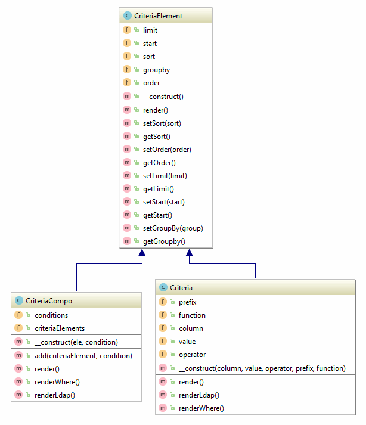

## Criteria

The XOOPS API has a class called **Criteria** to aid in database searches. The class is defined as such:

```php
Criteria Criteria (string $column, string $value = , string $operator = '=', mixed $prefix = , mixed $function = )
```




It's handy for returning a list of objects from the XoopsPersistableObjectHandler class.
Example:
```php
$criteria = new Criteria('id', $object_id); 
$array = $objecthandler->getObjects($criteria, false, false);
```

This returns $array as an array of all elements following the criteria! If the third argument of the getObjects method is true, it returns objects instead, handy for bulk manipulation!

The Criteria class only handles a single 'WHERE' condition. If you need multiple conditions, use **CriteriaCompo** in combination with Criteria. Here is an example out of the mailusers file:
```php
$criteria_object = new CriteriaCompo();
foreach ($criteria as $c) {
     list ($field, $op, $value) = split(' ', $c); 
     $criteria_object->add(new Criteria($field,$value,$op), 'AND');
}
```
    
If you have just a few simple conditions, you can just use
```php
$criteria_object = new CriteriaCompo();
$criteria_object->add(new Criteria($field1,$value1,$op1), 'AND');
$criteria_object->add(new Criteria($field2,$value2,$op2), 'AND');
```
