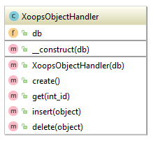

## XoopsObjectHandler 

#### Definition
**XoopsObjectHandler(Database $db )**

The early persistence architecture of XOOPS using the XoopsObjectHandler is a [Data Mapper pattern](http://martinfowler.com/eaaCatalog/dataMapper.html):
* XoopsObject: abstract class of data object
* XoopsObjectHandler: Mapper. An abstract class that saves XoopsObject in DB or rebuilds XoopsObject from DB


Most Important Methods
*   **create()** - creates a new object
*   **get()** - get object from database
*   **insert()** - save object in database (either insert or update)
*   **delete()** - delete object in database



#### Usage
Instead of instantiating your objects directly, the idea is to use the **ObjectHandler **instead. An object is created (new object - it can still come from the database or be an entirely new object) with this code:
```php
   $class_handler = xoops_getHandler('classname'); //NOT classnameHandler
   $thisobject = $class_handler->get($objectid);
```

This is for an existing object in the database. For a new object, use this:
```php
   $class_handler = xoops_getHandler('classname'); //NOT classnameHandler
   $thisobject = $class_handler->create();
```

This is for core classes. Module classHandlers should be fetched with
```php
   $classHandler = xoops_getModuleHandler('classname', 'dirname'); //NOT classnameHandler
```

The **ClassHandler** class should be in a file called ```classnameHandler.php``` placed in the modules/modulename/class directory. E.g. if the Story module has an Article class, extending XoopsObject, the class should be placed in a file called ```modules/story/class/Article.php``` with the handler class ```ArticleHandler``` in the file ```modules/story/class/ArticleHandler.php```

Originally these two classes were placed in the same file, but since we're moving to PSR, namespaces, and Autloading, each class has to be in a separate file.
same file and called ArticleHandler, extending XoopsPersistableObjectHandler and retrieved using the namespaced Helper class:
```php
Story\Helper::getInstance()->getHandler('Article');
```

You do not need to include the "Handler" word, if it follows the naming convention.
